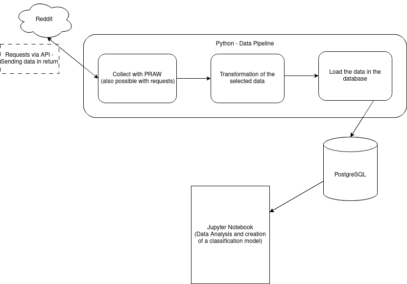

# Collection of Reddit Post

*Last update: 23th November 2023*

**Deprecated: This project is deprecated because of the pricing changes of [Reddit API](https://www.techtarget.com/whatis/feature/Reddit-pricing-API-charge-explained)).**

## Table of content

- [General Info](#general-info)
- [Technologies](#technologies)
- [Credits](#credits)
- [Source](#source)

## General Info

The aim of this project is to collect data from the social network Reddit.The library PRAW is used to communicate with the Reddit's API. After requesting Reddit's API, data are transformed into a dataframe by the data pipeline. After these transformations, the data are stored in a SQL Database (PostgreSQL). This database is used by a Jupyter Notebook in order to realise data analysis and create a Reddit's posts Classifier.

## Technologies

- [Python](https://www.python.org/)
- [PRAW](https://praw.readthedocs.io/en/stable/)
- [PostgreSQL](https://www.postgresql.org/docs/)
- ~~[Airflow](https://airflow.apache.org/)~~
- [Docker](https://www.docker.com/)

## Credits

- Cecile Guillot

## Source

- [Article from Start Data Engineering](https://www.startdataengineering.com/post/code-patterns/).
